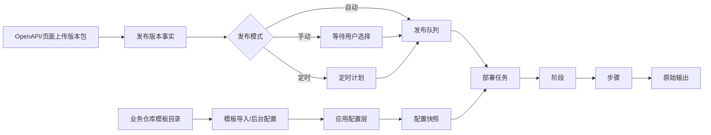

# qfy-sc 模板同构接入与平台收敛方案

## Summary

本方案把 `qfy-sc` 测试环境和生产环境的 easy-deploy 模板抽象为平台通用能力：平台只负责可视化维护发布单元、Compose/env/脚本/健康检查、发布时间计划、串行执行和日志观察；业务仓库只负责构建版本包和维护模板，不再维护远程部署逻辑。方案延续 Compose-only 主线，并明确 easy-deploy 不内置任何 qfy-sc 专属业务分支。

---

## Problem Frame

`qfy-sc` 已经在仓库中维护了 `deploy/easy-deploy/testing` 和 `deploy/easy-deploy/production` 两套模板。它们体现了后续正式环境应使用的真实接入方式：基础设施和业务应用都作为独立 Compose 发布单元管理，测试与正式环境尽量同构，差异只通过节点、`.env`、域名、密钥、脚本开关和配置快照表达。

当前 easy-deploy 已开始收敛到 Compose-only 和发布版本中心，但还需要继续调整产品边界：平台应成为通用部署控制台，而不是 qfy-sc 部署向导；OpenAPI 仍只保留版本包投递能力；应用创建、配置、发布时间和脚本过程都应留在后台可视化配置中。

---

## Requirements

- R1. 平台必须支持用 `qfy-sc` 的测试/生产模板形态创建普通应用配置，导入后不生成任何 qfy-sc 专属代码路径。
- R2. 平台必须支持测试环境与正式环境同构：相同发布单元拆分、相同脚本阶段、相同 Compose 结构，不同环境差异落在配置和快照里。
- R3. 基础设施类应用使用 `manual` 发布来源，不要求版本包；业务运行类应用使用 `package_upload`，由业务项目或 CI 通过 OpenAPI 投递版本包。
- R4. 发布版本事实和发布时间计划必须分离：上传版本包只代表收到可发布版本，是否立即、手动或定时发布由应用设置和队列计划决定。
- R5. 发布过程必须按任务、阶段、步骤、原始输出分层展示，脚本输出可复制、可折叠、可用于排障。
- R6. OpenAPI 对外只保留版本包投递，不提供应用创建、配置修改、节点读取、任务轮询或部署触发控制面。
- R7. 后续 qfy-sc 正式环境依赖本平台时，业务仓库不再写服务器部署脚本；服务器发布、服务启停、网关切换、回滚入口和执行日志由 easy-deploy 承接。

---

## Scope Boundaries

- 不做 Git tag 拉取、源码构建、镜像构建或服务器本地编译。
- 不做 qfy-sc 专属部署向导，不内置 qfy-sc 的域名、端口、数据库拓扑、seed 规则或日志链路判断。
- 不通过 OpenAPI 开放应用创建、配置修改、节点读取、任务读取或远程部署控制。
- 不承诺回滚业务数据库内容、外部挂载目录副作用或第三方状态。
- 不在平台内置 Caddy/Nginx 通用切流模板；蓝绿切流由用户配置的 `switch_traffic` 脚本完成。

### Deferred to Follow-Up Work

- qfy-sc 模板批量导入向导：本方案先定义平台能力边界，后续可单独实现“从目录导入一组发布单元”的辅助入口。
- 更强的脚本编辑器体验：可后续增加 diff、格式化、变量提示和模板片段，但首版以文本配置和阶段槽位为主。

---

## Context & Research

### Relevant Code and Patterns

- `docs/plans/2026-06-23-compose-only-release-pipeline.md` 已定义 Compose-only 主线、发布版本、发布队列、阶段日志和 OpenAPI 收缩方向。
- `docs/runbooks/compose-template-contract.md` 已记录业务仓库推荐提交的 `app.yaml.example`、`compose.yaml.example`、`.env.example`、`scripts/` 契约。
- `api/migrations/0038_compose_release_queue.sql` 已引入 `release_source`、`compose_strategy`、`app_releases` 和 `app_release_queue`。
- `api/migrations/0039_task_phases.sql` 已引入 `operation_task_phases`，并让步骤可挂接到阶段。
- `api/migrations/0040_release_publish_controls.sql` 已引入 `auto_queue_release` 和 `scheduled_publish_at`。
- `api/src/apps.rs` 当前已包含 release/queue/定时发布逻辑，但仍混有大量 Binary 兼容路径，是后续收敛的主要风险点。
- `api/src/web/mod.rs` 当前已暴露 `/api/v1/services/{service_key}/packages`、`/openapi.json` 和 `/docs/openapi`，但页面与公开 API 仍在同一超大模块里演进。

### qfy-sc 模板观察

- `qfy-sc` 测试环境和生产环境都按发布单元拆分：PostgreSQL、Redis、NATS、Loki、Alloy、Gateway、Backend、Worker 和前端静态应用。
- 基础设施模板天然适合 `release_source=manual`，例如 Redis、PostgreSQL、NATS、Loki、Alloy 和 Gateway。
- 业务运行模板适合 `release_source=package_upload`，例如 backend、worker、admin、merchant-admin、supplier-admin 和 oc-web。
- 后端镜像在测试环境中可继续使用 `latest` tag，版本事实由 easy-deploy 的发布版本记录表达，而不是由 Docker tag 表达。
- migration、seed、mq repair、healthcheck 等动作只是用户脚本阶段，不应进入平台枚举。

---

## Key Technical Decisions

- 把 qfy-sc 的模板形态抽象为“发布单元模板契约”：平台只理解 app 元数据、Compose、env、脚本槽位、健康检查和目标节点，不理解业务动作含义。
- 应用仍是一等对象，服务只是 Compose 解析出来的只读视图；不要重新把 backend/worker/api-consumer 拆成平台一级“服务”对象。
- 发布版本和发布计划分层保存：`app_releases` 记录版本事实，`app_release_queue` 记录立即、手动或定时发布计划。
- 首版脚本编排使用固定阶段槽位，而不是无限流程编排器：`pre_deploy`、`deploy`、`post_deploy`、`switch_traffic`、`cleanup` 足够承载 qfy-sc 当前模板。
- 版本包继续保持 opaque package：平台校验包名、应用归属、版本号、校验和和落盘安全，包内内容由用户脚本消费。
- 测试/正式同构通过复制应用配置结构和调整环境差异实现，不通过平台内置“测试环境/正式环境专用逻辑”实现。

---

## Open Questions

### Resolved During Planning

- 是否让 qfy-sc 正式环境成为平台专属能力：否。平台只提供通用发布单元能力，qfy-sc 通过配置接入。
- 是否恢复 Git tag 自动发布：否。版本包仍由业务项目或 CI 构建后投递到 easy-deploy。
- 是否用 Docker image tag 表达业务版本：否。镜像 tag 可继续用 `latest`，版本事实由上传包和 release 记录表达。

### Deferred to Implementation

- 模板导入时如何处理脚本文件名到阶段槽位的映射：实现时根据现有模板命名和 UI 交互确定，不能在计划里写死 qfy-sc 脚本名。
- 定时发布调度器的轮询间隔和锁实现细节：取决于现有后台任务循环与 SQLite 并发约束。
- 首版是否支持一次导入多个发布单元：可后续增强，当前核心是导入后生成普通应用配置。

---

## High-Level Technical Design

> 这段图示只用于说明方案形态，是给评审和实现时参考的方向性设计，不是要求照抄的实现代码。

核心约束：导入模板只生成 `AppConfig`，上传版本包只生成 `Release`，执行由 `Queue + Task` 驱动。任何业务含义都停留在 Compose/env/scripts 内容中，不进入平台分支判断。

---

## Implementation Units

### U1. 模板契约导入与普通应用落库

**Goal:** 支持从 `app.yaml.example`、`compose.yaml.example`、`.env.example` 和 `scripts/` 初始化普通 Compose 应用配置，并保留后台手动编辑能力。

**Requirements:** R1, R2, R3

**Dependencies:** 现有应用创建、配置快照和 Compose 保存能力。

**Files:**
- Modify: `api/src/apps.rs`
- Modify: `api/src/web/mod.rs`
- Modify: `api/src/web/templates.rs`
- Modify: `api/templates/apps.html`
- Modify: `api/templates/app_detail.html`
- Test: `api/src/apps.rs`
- Test: `api/src/web/mod.rs`

**Approach:**
- 导入后只创建普通应用、目标节点绑定、Compose/env 内容和脚本阶段配置。
- `app.yaml.example` 中的 `release_source`、`deploy_strategy`、健康检查字段映射到现有应用配置。
- 未识别字段进入备注或 metadata，不创建业务专属列。
- 继续允许用户在后台直接创建应用，不强制必须从模板导入。

**Patterns to follow:**
- 现有 `CreateAppInput` / `UpdateAppInput` 表单归一化。
- `docs/runbooks/compose-template-contract.md` 中的模板字段约定。

**Test scenarios:**
- Happy path：导入 backend 模板后生成 `package_upload` 应用、Compose 内容、env 内容和健康检查配置。
- Happy path：导入 redis 模板后生成 `manual` 应用，不要求版本包。
- Edge case：模板中缺少 `.env.example` 时仍允许创建应用，但 env 内容为空并给出提示。
- Error path：`app_key` 缺失或包含非法字符时拒绝导入。
- Integration：导入后保存配置会生成配置快照，后续发布队列可绑定该快照。

**Verification:**
- 页面创建和模板导入创建出的应用在详情页表现一致，没有 qfy-sc 专属分支。

---

### U2. 发布计划与队列语义收敛

**Goal:** 明确“收到版本包”和“执行发布时间”分离，完善自动入队、手动发布、定时发布三种路径。

**Requirements:** R4

**Dependencies:** `app_releases`、`app_release_queue`、`auto_queue_release`、`scheduled_publish_at` 已存在。

**Files:**
- Modify: `api/src/apps.rs`
- Modify: `api/src/tasks.rs`
- Modify: `api/templates/artifacts.html`
- Modify: `api/templates/app_detail.html`
- Test: `api/src/apps.rs`
- Test: `api/src/tasks.rs`

**Approach:**
- `app_releases` 只表达版本事实，不直接表达发布时间。
- `app_release_queue` 负责 queue 状态、发布时间、任务关联和失败阻塞。
- 应用级 `auto_queue_release=true` 时上传即创建队列项。
- 手动模式下上传只登记 release，用户在发布版本页选择“发布”或“定时发布”。
- 定时发布到期后才进入可执行队列，仍遵守同一应用串行锁。

**Patterns to follow:**
- 现有 `schedule_release_publish`、`cancel_scheduled_release_publish` 和队列查询逻辑。

**Test scenarios:**
- Happy path：自动入队应用上传版本包后立即生成 `queued` 队列项。
- Happy path：手动发布应用上传版本包后只生成 `received` release，不生成队列项。
- Happy path：定时发布在时间未到时不执行，时间到后进入队列。
- Edge case：同一应用连续上传多个版本按接收顺序串行，不按 `version_code` 插队。
- Error path：失败队列项阻塞后续版本，必须人工重试或取消。

**Verification:**
- 发布版本页能清晰显示“版本事实状态”和“队列计划状态”，不会把上传等同于发布。

---

### U3. 脚本阶段可视化与执行日志

**Goal:** 把 qfy-sc 的 migration、seed、healthcheck 等动作落到通用脚本阶段槽位，并在任务详情中按层级展示输出。

**Requirements:** R5

**Dependencies:** `operation_task_phases` 和 `operation_task_steps.phase_id` 已存在。

**Files:**
- Modify: `api/src/deploy.rs`
- Modify: `api/src/tasks.rs`
- Modify: `api/src/apps.rs`
- Modify: `api/templates/task_detail.html`
- Test: `api/src/tasks.rs`
- Test: `api/src/apps.rs`
- Test: `e2e/tests/smoke.rs`

**Approach:**
- 固定阶段槽位：`pre_deploy`、`deploy`、`post_deploy`、`switch_traffic`、`cleanup`。
- `deploy` 为必填，其余可为空；空阶段记录为 skipped 或不生成步骤，但 UI 要能解释。
- 每个脚本执行时注入 `ED_*` 上下文变量。
- 任务详情默认展示阶段摘要，步骤和原始输出默认折叠。
- 提供一键复制任务日志和单阶段日志，方便排障粘贴。

**Patterns to follow:**
- 现有任务步骤、事件日志和“复制事件日志”交互。
- `qfy-sc` 模板中的脚本只作为用户配置样例，不作为平台内置枚举。

**Test scenarios:**
- Happy path：一个包含 pre/deploy/post/healthcheck 的发布任务生成正确阶段和步骤。
- Happy path：脚本 stdout/stderr 能在任务详情中展开查看并复制。
- Edge case：空脚本阶段不会导致任务失败。
- Error path：脚本返回非 0 时，阶段、步骤、任务和队列状态都标记失败，并阻塞后续队列。
- Integration：同一任务从发布版本页、应用详情页、任务页都能跳转到相同任务详情。

**Verification:**
- 用户能在 UI 中不看服务器日志也定位到失败阶段、命令输出和对应版本。

---

### U4. OpenAPI 最小化与文档强化

**Goal:** 保留一个公开版本包投递入口，并把文档写到其他项目的 AI 可以直接据此接入。

**Requirements:** R6, R7

**Dependencies:** 当前已有 `/api/v1/services/{service_key}/packages`、`/openapi.json` 和 `/docs/openapi`。

**Files:**
- Modify: `api/src/web/mod.rs`
- Modify: `README.md`
- Test: `api/src/web/mod.rs`

**Approach:**
- 公开文档只描述版本包命名、鉴权、请求示例、返回字段、自动/手动/定时发布语义和错误处理。
- `openapi.json` 只保留版本包投递相关 schema。
- 明确外部项目脚本只需要构建版本包并上传，不需要知道节点、Compose、脚本或密钥配置。
- 示例使用 qfy-sc 风格服务名，但表述为示例，不绑定项目专属能力。

**Patterns to follow:**
- 现有在线文档样式和 qfy-sc 独立接口文档样式。

**Test scenarios:**
- Happy path：无需登录可访问 `/docs/openapi` 和 `/openapi.json`。
- Happy path：文档包含上传 curl 示例、文件命名规则、状态语义和常见错误。
- Error path：包名不符合 `{service_key}_version_{x_y_z}.tar.gz` 时返回清晰错误。
- Error path：service_key 不存在或应用不是 `package_upload` 时返回可理解错误。

**Verification:**
- 其他项目的 AI 只读取在线文档即可写出上传版本包脚本。

---

### U5. 页面对象与菜单再收敛

**Goal:** 让后台继续围绕“应用、发布版本、部署任务、节点、凭据、权限、系统”组织，避免重新出现服务/制品/模板多主对象心智。

**Requirements:** R1, R2, R3, R5

**Dependencies:** Compose-only 页面改造和现有布局。

**Files:**
- Modify: `api/templates/layout.html`
- Modify: `api/templates/apps.html`
- Modify: `api/templates/app_detail.html`
- Modify: `api/templates/artifacts.html`
- Modify: `api/templates/templates.html`
- Modify: `api/src/web/templates.rs`
- Test: `api/src/web/mod.rs`
- Test: `e2e/tests/smoke.rs`

**Approach:**
- 应用详情页突出部署配置、发布计划、最近任务。
- 发布版本页定位为版本中心，不再出现“制品”或 Binary 语义。
- 模板页定位为只读模板和导入辅助，不作为长期管理对象。
- 服务页如保留，只作为应用详情内的 Compose services 视图或日志定位入口。
- 所有页面文案避免 qfy-sc 专有词，示例可以来自 qfy-sc 但要标注为示例。

**Patterns to follow:**
- 当前后台低依赖 HTML/CSS/htmx 风格。
- 已有表格组件和弹窗交互。

**Test scenarios:**
- Happy path：从应用列表进入详情，可以完成配置保存、查看版本队列和查看任务日志。
- Happy path：发布版本页可按应用、状态、来源过滤。
- Edge case：`manual` 应用不显示“等待版本包上传”的主提示，而显示“发布当前配置”。
- Edge case：`package_upload` 应用未收到版本包时显示接入说明，而不是空白列表。
- Error path：用户权限不足时仍按现有 RBAC 隐藏操作入口。

**Verification:**
- 用户可以按“先创建应用，再接收版本，再发布”的路径完成工作，不需要理解旧 Binary/systemd 链路。

---

### U6. Binary/systemd 业务应用链路隔离与退场

**Goal:** 继续隔离并最终删除业务应用级 Binary/systemd 旧链路，避免 qfy-sc 正式环境接入时被旧能力误导。

**Requirements:** R1, R3, R6

**Dependencies:** U1-U5 形成可用 Compose 主链路。

**Files:**
- Modify: `api/src/apps.rs`
- Modify: `api/src/runtimefs.rs`
- Modify: `api/src/web/mod.rs`
- Modify: `api/src/web/templates.rs`
- Modify: `api/src/maintenance.rs`
- Modify: `api/templates/app_detail.html`
- Modify: `api/templates/artifacts.html`
- Test: `api/src/apps.rs`
- Test: `api/src/web/mod.rs`
- Test: `e2e/tests/smoke.rs`

**Approach:**
- 保留历史数据读取兼容，但不再允许创建新的 `app_type=binary` 应用。
- 删除或隐藏所有 Binary 上传、Binary restart/stop、Binary blue-green proxy 入口。
- 将仍需保留的历史 helper 暂时隔离到 legacy 模块，避免污染 Compose 主链路。
- easy-deploy 自身 systemd 部署规则不受影响，删除范围只针对“被部署业务应用的 systemd 能力”。

**Patterns to follow:**
- `docs/plans/2026-06-23-compose-only-release-pipeline.md` 的阶段 E。

**Test scenarios:**
- Happy path：现有 Compose 应用流程不依赖任何 Binary 字段。
- Error path：提交 `app_type=binary` 创建请求时被强制归一为 Compose 或拒绝。
- Integration：旧数据库里存在 Binary 历史数据时，应用列表、发布版本页和任务页不崩溃。

**Verification:**
- 后台和公开接口中没有可用的业务应用 Binary/systemd 发布入口。

---

## System-Wide Impact

- **Interaction graph:** 业务仓库只调用 OpenAPI 上传版本包；后台页面维护配置；调度器读取队列并创建部署任务；任务详情展示阶段日志。
- **Error propagation:** 上传校验错误停留在 release 创建前；队列调度错误写入队列和任务；脚本失败写入阶段、步骤、任务和事件日志。
- **State lifecycle risks:** 配置保存生成快照，入队绑定快照；后续修改配置不能污染已入队发布。
- **API surface parity:** 页面上传和 OpenAPI 上传应进入同一 release/queue 逻辑，只是 source 不同。
- **Integration coverage:** 需要覆盖“模板导入 -> 上传版本包 -> 入队/定时 -> 执行任务 -> 查看日志”的跨层 smoke。
- **Unchanged invariants:** 平台自身仍可用 systemd 单机部署；SQLite 和低依赖 HTML/CSS/htmx 架构保持不变。

---

## Risks & Dependencies

- 脚本质量决定发布稳定性：通过阶段日志、失败阻塞、复制输出和文档约束降低排障成本。
- 模板导入容易变成 qfy-sc 专属向导：导入后必须只产生普通应用配置，禁止内置 qfy-sc 分支。
- `api/src/apps.rs` 和 `api/src/web/mod.rs` 仍然过大：功能落地前后都应逐步拆模块，避免继续扩大单文件风险。
- 定时发布和串行队列依赖 SQLite 锁语义：实现时需要重点验证并发上传、到期调度和失败阻塞。
- 用户可能误解回滚能力：页面和文档必须明确只回滚版本包和配置快照，不回滚业务数据。

---

## Documentation / Operational Notes

- 更新 `docs/runbooks/compose-template-contract.md`，补充 qfy-sc 测试/正式同构的推荐落地示例。
- 更新在线 OpenAPI 文档，让外部项目 AI 能直接据此编写上传脚本。
- 更新 README，把“业务仓库维护模板和构建包，easy-deploy 管理服务器发布”的边界写清楚。
- 在发布版本和任务详情页面明确显示：版本、配置快照、发布时间、触发来源、任务 ID 和日志复制入口。

---

## Sources & References

- Origin plan: `docs/plans/2026-06-23-compose-only-release-pipeline.md`
- Template contract: `docs/runbooks/compose-template-contract.md`
- qfy-sc testing templates: `deploy/easy-deploy/testing/README.md` in qfy-sc
- qfy-sc production templates: `deploy/easy-deploy/production/README.md` in qfy-sc
- Related schema: `api/migrations/0038_compose_release_queue.sql`
- Related schema: `api/migrations/0039_task_phases.sql`
- Related schema: `api/migrations/0040_release_publish_controls.sql`
