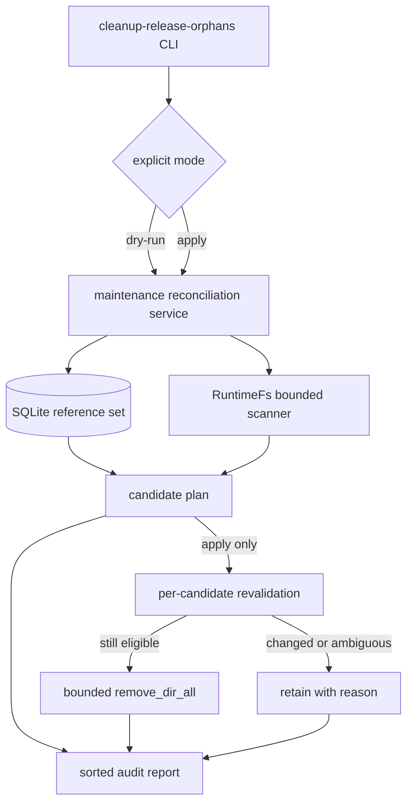
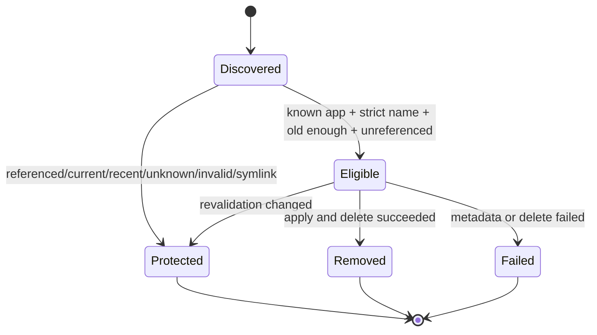
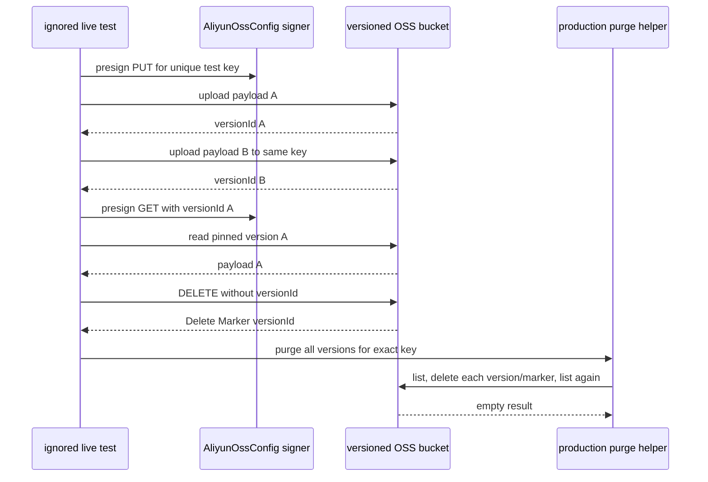
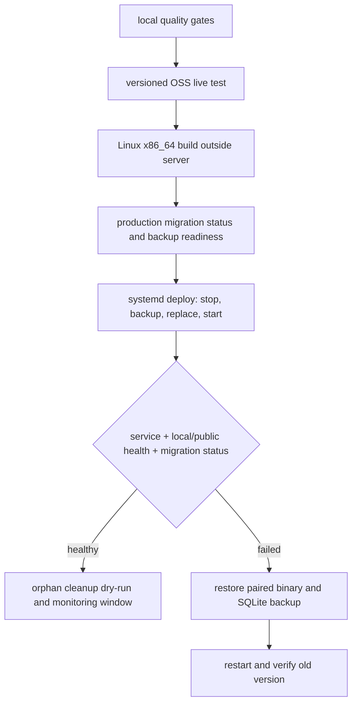

# 发布制品可靠性收尾 - Plan

## Goal Capsule

- **Objective:** 在现有发布制品不可覆盖、服务端校验、OSS 版本绑定和后台清理能力之上，补齐本地孤儿目录回收、真实阿里云 OSS 集成验证、migration 升级演练和正式环境发布闭环。
- **Authority:** 用户确认的本计划范围优先于技术实现偏好；仓库根目录协作规则优先于本计划中的一般执行建议；现有代码和 migration 是实现基线，不因计划执行而重写历史。
- **Execution profile:** Deep、高风险、顺序执行。工作涉及本地文件物理删除、SQLite 持久化数据、阿里云 OSS 外部契约和正式环境发布，执行者不得并行修改共享文件或跳过前置验证。
- **Executor assumption:** 后续可能由低能力模型执行。每个 Implementation Unit 都必须按 `Dependencies`、`Files`、`Approach`、`Test scenarios`、`Verification` 的顺序完成，不允许根据标题自行扩展范围。
- **Stop conditions:** 发现需要修改 `api/migrations/0001` 至 `0046`、无法证明目录不受数据库或当前版本指针引用、真实 OSS 测试无法完成残留对象清理、正式环境备份失败、migration 状态出现 `changed`/`dirty`/`missing`、服务或健康检查失败时立即停止，不得继续删除或发布。
- **Tail ownership:** 实现阶段按仓库规则在 `main` 完成相关验证、提交和推送；正式环境步骤只有在所有本地与真实 OSS gate 通过后执行。

---

## Product Contract

### Summary

本计划只处理已合入发布制品能力的剩余可靠性缺口：提供必须显式选择 dry-run 或 apply 的本地孤儿目录维护命令；用真实的版本控制 OSS Bucket 验证版本绑定和物理清理；演练 `0040` 到 `0046` 的数据升级；最后在 `qfy-sc-test` 完成可回滚发布和部署后检查。

### Problem Frame

本地版本包上传已经使用 staging 目录并通过原子重命名提升到正式版本目录，数据库写入失败时也会执行进程内补偿。但是进程若恰好在目录提升后、SQLite 事务提交前崩溃，补偿逻辑没有机会运行，文件系统可能保留数据库不可见的版本目录或 staging 目录。

OSS 路径已经覆盖服务端 SHA-256/大小校验、版本号绑定、历史版本和 Delete Marker 删除、清理重试以及响应大小限制，但当前只有 mock 和解析测试，没有通过真实阿里云 OSS 验证签名、版本控制、指定版本下载和物理删除的完整链路。

本地开发数据库当前应用到 `0040`，`0041` 至 `0046` 尚未应用。已有测试覆盖从 `0043` 升级到当前版本，但正式环境可能从 `0040` 一次跨越到 `0046`，需要在发布前用带代表性数据的夹具演练完整升级路径。

### Requirements

#### Migration 安全

- R1. 必须新增从 `0040` 数据库状态升级到 `0046` 的回归测试，并验证已有任务、发布版本、发布队列、外键和索引语义不丢失。
- R2. 禁止修改、删除或重命名 `api/migrations/0001_init.sql` 至 `api/migrations/0046_oss_release_integrity_states.sql`；本计划不需要新增 schema，也不创建 `0047` migration。

#### 本地孤儿目录回收

- R3. 必须提供独立维护命令，且调用者必须显式选择 `--dry-run` 或 `--apply`；未选择模式和同时选择两种模式都必须拒绝执行。
- R4. 维护命令默认最小目录年龄为 24 小时，只扫描数据库中已存在应用的 `releases` 目录，不遍历或删除未知应用目录。
- R5. 数据库中任意 `app_releases` 记录引用的版本、应用 `current` 指针引用的版本、年龄不足、名称不符合严格约定、元数据读取失败、符号链接或非目录项都必须保留。
- R6. 真正删除前必须重新读取数据库引用、当前版本指针、目录类型和修改时间；任一条件发生变化时将候选降级为保留，不得沿用扫描阶段结论。
- R7. dry-run 和 apply 必须输出稳定排序的逐项结果及汇总计数；单个目录删除失败时继续处理其他候选，但最终命令必须以失败状态结束并列出失败路径。
- R8. 对相同文件系统重复执行 dry-run 或 apply 必须幂等，不能把已经保留的有效版本变成候选，也不能把不存在目录当成失败。

#### 真实 OSS 验证

- R9. 必须把 OSS 全版本删除算法提取为生产代码可复用的单一入口，后台清理任务和真实集成测试调用同一实现，不能在测试中复制一套近似算法。
- R10. 真实 OSS 测试必须使用显式配置的测试 Bucket 和专用前缀，Bucket 必须启用版本控制；普通单测、E2E 和无凭证 CI 不得访问公网或读取真实凭证。
- R11. 真实 OSS 测试必须验证两次同 ObjectKey 上传会生成不同 versionId、指定旧 versionId 仍能读取原始内容、无 versionId 删除会创建 Delete Marker、清理入口最终删除全部版本和 Delete Marker。
- R12. 真实 OSS 测试无论成功或失败都必须执行 best-effort 清理；只要仍能枚举到测试 ObjectKey 的版本或 Delete Marker，测试必须失败并打印不含凭证的残留标识。
- R13. 测试日志、失败信息、文档和命令示例不得输出 AccessKey Secret、签名 URL 或完整 Authorization 信息。

#### 文档与正式发布

- R14. 必须新增发布制品可靠性 runbook，覆盖孤儿目录命令、OSS 测试前置条件、最小权限、migration 预检、正式发布、监控和成对回滚二进制/SQLite 的步骤。
- R15. 正式发布目标固定为 SSH 别名 `qfy-sc-test`、systemd 服务 `easy-deploy.service` 和域名 `https://easy-deploy.quanxinfu.com`，不得修改其他项目的 Caddy 配置。
- R16. 正式发布前必须在本地或构建容器生成 Linux x86_64 二进制，不得在低内存正式服务器上执行 release 编译。
- R17. 正式发布后必须确认服务 active、本机和公网 `/healthz` 成功、production migration 全部 applied 且无异常状态、日志无 migration/OSS 清理错误，并执行一次本地孤儿目录 dry-run。

### Success Criteria

- 从 `0040` 构造的代表性 SQLite 夹具可无错误升级到 `0046`，升级后 `PRAGMA foreign_key_check` 无结果，迁移记录完整。
- dry-run 对符合条件的孤儿目录只报告不删除；apply 只删除经过二次校验仍符合条件的目录。
- 有效 release、当前 release、近期目录、未知应用目录和符号链接在所有测试中保持不变。
- 真实 OSS 测试证明指定 versionId 的内容不可被后续同 key 上传替换，并在结束时枚举不到任何测试版本或 Delete Marker。
- `main` 的格式、编译、单测、clippy、migration guard 和 E2E 全部通过。
- `qfy-sc-test` 发布后 migration 为 `pending=0`、`changed=0`、`dirty=0`、`missing=0`，本机和公网健康检查均成功。

### Acceptance Examples

- AE1. Given 某应用的 `releases/v1.2.3` 已存在超过 24 小时且数据库和 `current` 都没有引用，When 运行 `--dry-run`，Then 目录被报告为可删除但仍存在；When 服务停止后运行 `--apply`，Then 目录被删除并计入 removed。
- AE2. Given 同一目录已有 `app_releases` 记录，或 `current` 指向该版本，When 运行任一模式，Then 目录被报告为 protected 且不执行删除。
- AE3. Given `.staging-*` 目录名称合法但创建不足 24 小时，When 运行维护命令，Then 它被报告为 too-young；达到最小年龄后才可成为候选。
- AE4. Given `releases` 下存在符号链接、普通文件、非法名称或未知应用目录，When 扫描，Then 工具不得跟随或删除它们，并给出明确保留原因。
- AE5. Given 版本控制 Bucket 中同一 ObjectKey 先后上传内容 A 和 B，When 使用第一个 versionId 下载，Then 仍得到 A；When 执行无版本删除，Then列表出现 Delete Marker；When 调用生产清理入口，Then版本与 Delete Marker 均为空。
- AE6. Given 真实 OSS 测试在中间断言失败，When 测试结束，Then 仍尝试清理已知 ObjectKey；若清理不完整，原始错误和清理错误都必须保留。
- AE7. Given 正式发布后服务启动或 migration 校验失败，When 触发回滚，Then 同一备份目录中的旧二进制和旧 SQLite 一起恢复，旧服务重新通过本机和公网健康检查。

### Scope Boundaries

- 不把孤儿目录清理接入服务启动流程、后台定时任务、Web 页面或 OpenAPI。
- 不自动清理未知应用目录，也不清理远程目标节点上的发布目录。
- 不实现 quarantine、回收站或长期归档；本轮使用 dry-run、最小年龄、引用保护和显式 apply 控制风险。
- 不新增 S3、MinIO 或其他存储后端，不把阿里云 OSS 测试抽象为通用对象存储兼容测试。
- 不要求普通 CI 持有阿里云凭证，不把真实 OSS 测试加入默认 `cargo test` 执行路径。
- 不在本计划中修复或迁移历史 `storage_integrity=legacy` OSS release；现有部署阻断保持不变。
- 不修改 Caddy，除非正式发布后公网健康检查失败且明确证明问题来自 easy-deploy 的独立站点配置；即使需要处理，也只能改 `easy-deploy.quanxinfu.com.caddy` 并先 validate。

#### Deferred to Follow-Up Work

- 将孤儿目录扫描结果接入后台指标、管理页面或告警。
- 为删除候选增加 quarantine 和延迟物理删除策略。
- 为 OSS 测试提供独立预发布账号和自动化定时环境。
- 清理数据库中已删除应用对应的整个 runtime 根目录。

---

## Planning Contract

### Current Baseline

- `afa6c43` 已实现本地 staging/原子提升、OSS 流式校验、版本绑定、预约、过期释放、后台清理和 migrations `0044` 至 `0046`。
- `a51715f` 已把清理任务领取改为 `UPDATE ... RETURNING`，并为 OSS 版本列表增加 8 MiB 流式响应上限。
- `api/src/apps.rs::upload_release_package` 的剩余崩溃窗口位于目录提升或 `release.yaml` 写入完成后、数据库事务提交前。
- `api/src/apps.rs::cleanup_release_upload_object` 负责数据库 claim/retry 状态，也直接包含版本枚举和逐版本删除逻辑。
- `api/src/runtimefs.rs` 负责 release 目录命名、staging、提升、运行时元数据和 `current` 指针，是文件系统边界的唯一合适归属。
- `api/src/maintenance.rs` 已有 `clean_demo_data` 的 options/report/dry-run 模式，可复用其维护服务和测试结构。
- `api/src/main.rs` 已有 clap 子命令、维护命令输出和临时数据库测试模式。
- `scripts/deploy-systemd.sh` 已在替换二进制前停止运行中的服务并备份二进制和 SQLite，服务启动时会自动应用 pending migration。

### Key Technical Decisions

- KTD1. 孤儿目录回收采用离线维护命令，不加入服务启动。原因是自动删除会把数据库暂时不可见、文件系统延迟和运维误配置放大为启动期数据损失。
- KTD2. 命令要求 `--dry-run` 与 `--apply` 二选一，且默认最小年龄为 24 小时。没有显式模式不得执行，避免省略参数直接进入破坏性路径。
- KTD3. 文件系统扫描只产生候选，数据库引用和 `current` 指针共同构成保护集合。即使数据库记录缺失，当前版本指针也足以阻止删除。
- KTD4. 只扫描数据库中存在的 `app_key`，只识别严格 release 名称和严格 `.staging-<release>-<pid>-<sequence>` 名称，并使用 `symlink_metadata` 拒绝符号链接。扫描器不递归进入候选目录。
- KTD5. apply 在每次删除前重新构建该应用的引用集合并重新检查文件元数据。扫描结果不是删除授权，只是待复核清单。
- KTD6. OSS 清理算法从应用状态机中提取为 `artifact_storage` 层的公开异步 helper；应用层继续拥有 claim、重试和数据库状态，helper 通过最多 4 轮 list/delete 收敛到空集合。公开可见性只用于让 `api/tests/aliyun_oss_live.rs` 复用生产入口，不公开底层签名 URL 或凭证。
- KTD7. 真实 OSS 测试使用启用版本控制的 Bucket。阿里云官方文档明确说明版本控制启用或暂停时 `x-oss-forbid-overwrite` 会被忽略，因此测试不期待第二次 PUT 返回 409，而是验证不同 versionId 和旧版本内容仍可指定读取。
- KTD8. 真实测试 ObjectKey 必须位于显式测试前缀下，并追加进程级唯一后缀。测试前缀去除首尾 `/` 后，第一个路径段必须严格等于 `integration-tests`，推荐值为 `integration-tests/easy-deploy`；空前缀、仅为 `integration-tests`、使用 `..`/`.` 路径段或不满足此前缀根约束的值都必须拒绝。
- KTD9. migrations `0041` 至 `0046` 已提交且 guard 保护，本轮只补升级夹具和发布验证，不修改 SQL。
- KTD10. 生产回滚始终恢复同一时间点备份中的二进制和 SQLite。只回滚二进制可能无法兼容已升级 schema，不允许作为默认方案。

### High-Level Technical Design

#### Local cleanup component flow

#### Candidate lifecycle

#### Live OSS verification sequence

#### Production rollout gate

### Implementation Constraints

- 文件删除路径必须由 `RuntimeFs` 基于 `data_dir` 和已校验 `app_key` 构造，维护层不得接受数据库或 CLI 传入的任意绝对路径作为删除目标。
- 候选路径使用 `symlink_metadata` 判断类型，不调用会跟随符号链接的 metadata 作为删除资格依据。
- 文件系统时间读取失败时选择保留；不能把“无法证明足够旧”解释为“可以删除”。
- 数据库查询失败、`current` 文件解析失败、引用集合构建失败时，该应用本轮不得执行任何删除。
- dry-run 与 apply 共用同一 discovery 和 classification 代码；不得为两种模式维护两套规则。
- OSS helper 不负责写数据库，也不吞掉 list/delete 错误；应用层必须继续把错误写入 `cleanup_error` 并释放 claim 供下次重试。
- OSS purge helper 必须是 `artifact_storage` 模块中的公开函数，以供独立 integration test crate 调用；参数和错误中只能暴露规范化配置、精确 ObjectKey、versionId 与状态，不返回 presigned URL 或 Secret。
- 真实测试只从环境变量构造 `AliyunOssConfig`，不读取或修改 `platform_settings`，避免测试触碰正式业务配置。
- live test 的断言不得在 cleanup 之前直接 panic；先保存主流程结果，再执行 cleanup，最后组合并返回主流程与清理结果。
- 任何日志和报告只打印 Bucket、测试 ObjectKey、versionId 和状态，不打印 Secret 或带 Signature 的 URL。

### System-Wide Impact

- **Filesystem lifecycle:** 新命令只影响本机 `EASY_DEPLOY_DATA_DIR/apps/<app_key>/releases`，不触碰应用 work_dir、远程节点、credentials 或数据库文件。目录保护规则必须与 RuntimeFs 的实际命名保持同步。
- **Database lifecycle:** 维护命令只读 apps、app_releases 和 current pointer，不删除或修改业务行。U1 会增加 migration 测试夹具，但不会改变 migration SQL。
- **Background cleanup:** U5 调整 OSS 对象动作的归属，但 app_release_uploads 的 claim、attempts、completed/error 状态和调度 worker 保持原接口与重试语义。
- **CLI surface:** `cleanup-release-orphans` 是新的本机运维入口，不暴露到 Web、OpenAPI 或 agent tool。破坏性行为仍由拥有服务器 shell 权限的运维人员控制。
- **External service:** U6 会对显式测试前缀执行真实 PUT、GET、ListObjectVersions 和 DELETE，会产生少量请求费用和短暂对象版本；普通测试路径无外部影响。
- **Deployment:** U8 会让 production SQLite 从当前版本应用到 `0046`，并短暂停止 systemd 服务。Caddy、域名和其他项目服务不在正常变更路径内。

### Risks and Dependencies

- **服务未停止时发生 TOCTOU:** 本地上传可能在扫描后创建目录。缓解方式是 24 小时最小年龄、apply 前二次校验，以及 runbook 强制 apply 前停止 `easy-deploy.service`。
- **mtime 不可靠或不可读:** 某些文件系统时间精度不同。缓解方式是使用保守的 `age >= min_age`，读取失败一律 protected，测试只依赖明显边界而不假设纳秒精度。
- **符号链接或目录替换:** 路径可能在扫描和删除之间变化。缓解方式是只构造已知根下路径、使用 symlink_metadata、删除前重查；发现类型变化立即 protected。
- **OSS 清理不收敛:** 版本控制 Bucket 的无版本 DELETE 会创建 Delete Marker，或外部写入可能持续产生版本。缓解方式是 fallback delete 最多执行一次、list/delete 循环设置固定轮次上限、只有一次 list 确认空集合后才成功、超过上限返回可重试错误。
- **OSS 测试凭证权限不足:** 缺少 ListObjectVersions 或指定版本 Delete 会导致残留。缓解方式是 runbook 先核对最小权限，测试从一开始记录 ObjectKey，清理失败阻断后续发布。
- **版本控制暂停:** Suspended Bucket 返回 null version，不能提供 version-pinned 保证。缓解方式是 live gate 明确要求 Enabled，发现 null 立即失败。
- **migration 跨版本升级:** `0041`、`0042` 会重建表。缓解方式是 U1 代表性 `0040` 夹具、foreign_key_check、正式部署前备份和成对回滚。
- **正式环境资源限制:** `qfy-sc-test` 内存较小。依赖本地或容器构建 Linux x86_64 二进制，服务器只执行上传、备份、替换、migration 和健康检查。

### Sequencing

1. 先完成 U1，锁定 production migration 升级安全基线。
2. 再完成 U2、U3、U4，按 RuntimeFs 边界、维护服务、CLI 的依赖顺序落地本地回收能力。
3. 完成 U5 后再写 U6，确保 live test 调用的是真实生产清理入口。
4. U7 汇总已经稳定的命令和外部契约，不提前为尚未通过测试的行为写 runbook。
5. 只有 U1 至 U7 全部通过 Verification Contract 后才能执行 U8 正式发布。

---

## Implementation Units

### U1. 演练从 migration 0040 升级到 0046

- **Goal:** 用代表性持久化数据证明正式环境可能经历的完整 migration 路径不会丢失任务、发布版本或队列语义。
- **Requirements:** R1, R2, R17
- **Dependencies:** None
- **Files:**
  - Modify/Test: `api/src/apps.rs`
  - Read only: `api/migrations/0040_release_publish_controls.sql`
  - Read only: `api/migrations/0041_task_script_phase_constraint.sql`
  - Read only: `api/migrations/0042_release_queue_scheduled_status.sql`
  - Read only: `api/migrations/0043_artifact_storage_uploads.sql`
  - Read only: `api/migrations/0044_release_upload_reservations.sql`
  - Read only: `api/migrations/0045_release_upload_cleanup_and_object_versions.sql`
  - Read only: `api/migrations/0046_oss_release_integrity_states.sql`
- **Approach:** 在现有 `release_upload_reservation_migrations_upgrade_existing_0043_rows` 附近新增独立测试。使用 `sqlx::migrate::Migrator` 只应用到 `0040`，插入一个 package-upload 应用、local release、带 `scheduled_publish_at` 的 queue、关联 operation task 和代表性状态，再运行完整 migrator。不要改造现有 `0043` 升级测试，两者分别保护 `0040 -> current` 和 `0043 -> current`。
- **Execution note:** 先让新测试只构造并读取 `0040` 夹具，确认旧 schema 与种子数据有效；再运行完整 migrator并补升级后断言。
- **Patterns to follow:** `api/src/apps.rs::release_upload_reservation_migrations_upgrade_existing_0043_rows` 的 subset migrator、内存 SQLite、seed 和升级后查询模式。
- **Test scenarios:**
  - Happy path: `0040` local release 升级后 `storage_provider=local`、`storage_integrity=local`，原 version、checksum、size 和状态保持不变。
  - Integration: operation task 在 `0041` 表重建后保留 id、release_id、phase、status 和 summary，相关索引与 active-task trigger 仍能工作。
  - Integration: release queue 在 `0042` 表重建后保留关联关系，并把 release 上的 `scheduled_publish_at` 迁移到 queue。
  - Integration: `0043` 至 `0046` 创建设置、上传表和完整性字段后，旧 local release 不被错误标记为 `legacy`。
  - Data integrity: `PRAGMA foreign_key_check` 返回空集合，`_sqlx_migrations` 的最大 version 为 46，所有行 success。
  - Error guard: 测试只读取历史 migration；待提交 diff 不得包含 `api/migrations/*.sql` 修改。
- **Verification:** 新旧两个 migration upgrade 测试都通过，且 migration guard 对 `origin/main` 通过。

### U2. 建立有边界的本地 release 目录扫描器

- **Goal:** 在 `RuntimeFs` 内提供只发现、不删除的候选枚举能力，并把路径安全、名称解析、年龄和当前版本指针读取集中在文件系统边界。
- **Requirements:** R4, R5, R8
- **Dependencies:** U1
- **Files:**
  - Modify/Test: `api/src/runtimefs.rs`
- **Approach:** 增加内部候选类型，区分 `staging` 与 `release`。扫描入口只接收已校验 app_key 和最小年龄，固定读取 `<data_dir>/apps/<app_key>/releases` 的直接子项。正式 release 名称必须通过现有 release id 校验；staging 名称必须从右侧解析数字 pid/sequence 并验证中间 release id。读取 `current` YAML 中的 app_key/release_version 作为额外保护信息。返回候选和保留项的原因，不在本单元删除目录。
- **Execution note:** 先为目录形状和 symlink 边界添加 characterization/失败测试，再实现扫描器；Windows 下创建 symlink 可能需要权限，相关测试必须按平台能力显式 skip，而不是把失败当通过。
- **Patterns to follow:** `RuntimeFs::app_root`、`validate_key`、`validate_release_id`、`stage_release_package_file` 的目录命名，以及现有 tempdir 异步文件测试。
- **Test scenarios:**
  - Happy path: 合法正式 release 目录和合法 `.staging-<release>-<pid>-<sequence>` 目录被识别为不同 kind。
  - Boundary: 缺少 apps、应用或 releases 目录时返回空结果，不报删除错误。
  - Boundary: 最小年龄为零时当前创建的合法目录可供维护层测试；最小年龄大于目录年龄时结果标记为 too-young。
  - Error path: 非法 release 名称、staging 缺少 pid/sequence、数字后缀非法、普通文件都被保留并给出原因。
  - Security: releases 下的符号链接或 junction 不被跟随，不成为可删除候选。
  - Current pointer: 合法 `current` 返回对应 release_version；内容缺失、app_key 不匹配或 release_version 非法时返回解析错误，由上层保护整个应用。
  - Determinism: 返回结果按 app_key、kind、path 排序，不依赖文件系统枚举顺序。
- **Verification:** runtimefs 定向测试通过；扫描器没有任意路径参数，也没有调用删除 API。

### U3. 实现 dry-run/apply 共用的孤儿目录维护服务

- **Goal:** 把数据库真相、当前版本保护、年龄规则、二次校验和删除报告组合成可测试的维护服务。
- **Requirements:** R4, R5, R6, R7, R8
- **Dependencies:** U2
- **Files:**
  - Modify/Test: `api/src/maintenance.rs`
  - Use: `api/src/runtimefs.rs`
- **Approach:** 新增 options、candidate/result/report 类型和维护入口。先查询 apps 的 app_key，再按应用查询所有 `app_releases.version`，不按 storage_provider 过滤，因为 OSS release 部署后也可能拥有本地 runtime 目录。discovery 阶段合并 DB 引用、`current` 和 U2 扫描结果；apply 阶段对每个 eligible 项重新查询该应用引用并重读 current/metadata。删除必须调用 RuntimeFs 的受限删除入口。报告包含 scanned、protected、eligible、removed、failed 计数和逐项 reason。
- **Execution note:** 先添加 dry-run 和保护集合测试，观察它们在未实现时失败；再实现 apply；最后增加二次校验与删除失败测试。
- **Patterns to follow:** `CleanDemoDataOptions`、`CleanDemoDataReport`、`clean_demo_data` 的服务边界；数据库夹具使用 `sqlx::migrate!` 和 tempdir。
- **Test scenarios:**
  - Covers AE1. old、合法、无引用的正式目录在 dry-run 中 eligible 但仍存在，在 apply 中 removed。
  - Covers AE2. 任意状态的 app_releases 行都保护同 version 目录，不仅保护 deployed 状态。
  - Covers AE2. current 指针保护数据库中不存在的 version，避免数据库异常时删除当前运行目录。
  - Covers AE3. old staging 可删除，recent staging 保留；年龄边界按 `age >= min_age` 才 eligible。
  - Covers AE4. unknown app 根目录完全不进入删除集合；已知应用中的非法项、文件和 symlink 保留。
  - Dry-run: 不调用删除入口，removed 为零，eligible 数量稳定。
  - Apply: 每个候选删除前重新查询；测试在 discovery 后插入 release 引用，apply 必须改为 protected。
  - Failure: 模拟一个目录删除失败时其他候选继续处理，report 同时包含 removed 和 failed，调用者得到整体失败信号。
  - Failure: 数据库查询或 current 解析失败时该应用零删除，错误包含 app_key 且不暴露任意文件内容。
  - Idempotency: 连续 apply 两次，第二次既不失败也不重复计数 removed。
  - Filter: 指定 app_key 时只扫描该应用；不存在 app_key 返回明确错误，不退化为全量扫描。
- **Verification:** maintenance 定向测试覆盖 discovery、dry-run、apply、revalidation、failure 和幂等路径；没有修改数据库业务数据。

### U4. 暴露安全的 cleanup-release-orphans CLI

- **Goal:** 让运维人员可以明确选择只读检查或离线删除，并获得可审计、可复制的终端结果。
- **Requirements:** R3, R4, R7, R13, R14
- **Dependencies:** U3
- **Files:**
  - Modify/Test: `api/src/main.rs`
  - Use: `api/src/maintenance.rs`
- **Approach:** 新增 `cleanup-release-orphans` 子命令。`--dry-run` 与 `--apply` 组成必选互斥模式；`--min-age-hours` 默认 24，CLI 只接受 1 至 8760；`--app-key` 可选。输出先列每个 path、kind、decision、reason，再列汇总。apply 存在 failed 项时先完整打印报告，再返回错误以产生非零退出码。
- **Execution note:** 先扩展 clap 解析测试，确保缺少模式和双模式都会失败，再连接维护服务。
- **Patterns to follow:** `Command::CleanDemoData` 的 clap、`run_command`、报告输出和临时数据库测试；保持中文 help 与现有 CLI 风格一致。
- **Test scenarios:**
  - Happy path: `--dry-run` 使用默认 24 小时，`--apply --min-age-hours 48 --app-key orders` 正确解析。
  - Error path: 不传模式、同时传两种模式、年龄为 0、年龄超过 8760 都由 clap 拒绝。
  - Integration: 临时数据库与 tempdir 中运行 dry-run，输出 report 且目录不变。
  - Integration: apply 删除 eligible 目录并保留 referenced 目录。
  - Failure: report 有 failed 时命令返回 non-zero，但已成功删除项仍出现在输出中。
  - Secret safety: CLI debug/output 不打印 Settings 以外的敏感平台设置，也不读取 OSS Secret。
- **Verification:** main CLI 解析和运行测试通过；手工运行 help 能看到互斥模式和“apply 前停止服务”的提示。

### U5. 提取并加固 OSS 全版本物理删除入口

- **Goal:** 让后台清理与真实集成测试共用同一 list/delete/re-list 算法，保证测试覆盖生产路径。
- **Requirements:** R9, R11, R12
- **Dependencies:** U1
- **Files:**
  - Modify/Test: `api/src/artifact_storage.rs`
  - Modify/Test: `api/src/apps.rs`
- **Approach:** 在 artifact_storage 层增加公开异步 purge helper，输入 verifier、规范化 config 和精确 ObjectKey，返回不含凭证的结果或错误。helper 使用 `fallback_attempted = false`，最多执行 4 轮，低能力模型必须逐条实现以下状态机，不得自行合并退出条件：
  1. 每轮首先调用一次 `list_versions`；list 失败立即返回错误。
  2. 如果列表非空，先用现有校验器验证全部条目；任何 Delete Marker 缺 versionId 或版本化列表混入无 versionId 条目时，在执行本轮任何 delete 前失败。
  3. 对校验后的每个条目调用指定 versionId 的 delete；任一 delete 失败都立即返回错误。只有本轮全部 delete 成功时才进入下一轮重新 list，不得根据 delete 的 2xx 响应直接宣告成功。
  4. 如果列表为空且 `fallback_attempted == false`，执行恰好一次无 versionId delete，把 `fallback_attempted` 设为 true，然后进入下一轮。该 fallback 用于处理 ListObjectVersions 看不到的未版本化对象；在版本控制 Bucket 中它可能创建 Delete Marker，所以此处不得成功返回。
  5. 如果列表为空且 `fallback_attempted == true`，返回成功。这是唯一成功出口。
  6. 四轮耗尽仍未从步骤 5 返回时，返回包含精确 ObjectKey、但不含 URL/Secret 的可重试残留错误。
  `cleanup_release_upload_object` 保留数据库 claim/retry，只把对象动作委托给 helper。
- **Execution note:** 先把现有版本清理 mock 测试指向 helper，确保重构前后行为一致；再增加 re-list 残留失败测试。
- **Patterns to follow:** `ArtifactObjectVerifier` trait、`validate_listed_object_versions`、`expired_uncompleted_oss_upload_deletes_every_object_version_and_marker`、`canceled_oss_upload_cleanup_retries_and_deletes_verified_object_version`。
- **Test scenarios:**
  - Happy path: 两个普通 version 和一个 Delete Marker 都以各自 versionId 删除，最终 re-list 为空。
  - Unversioned path: 首次 list 为空时执行一次无 versionId delete，后续空列表成功，fallback 不重复执行。
  - Versioned empty path: 首次 list 为空、无 versionId delete 创建 marker 时，下一轮枚举并删除 marker，最终空列表成功。
  - Error path: Delete Marker 缺 versionId 时在任何删除前失败。
  - Error path: 任一 delete 失败立即返回原错误，应用层清除 cleanup_started_at、保留 cleanup_completed_at 为空并写 cleanup_error。
  - Error path: 到达固定轮次上限仍有版本时返回残留错误，应用层保持可重试。
  - Idempotency: 对已为空 ObjectKey 再次 purge 成功。
  - Regression: 原有 canceled/expired cleanup 状态机测试继续通过，claim attempts 计数不变。
- **Verification:** artifact_storage 与 apps cleanup 定向测试通过；apps 中不再包含版本遍历删除细节。

### U6. 增加 opt-in 阿里云 OSS 真实集成测试

- **Goal:** 在真实版本控制 Bucket 上验证当前自研签名、versionId 绑定、指定版本下载、Delete Marker 枚举和生产 purge helper。
- **Requirements:** R10, R11, R12, R13
- **Dependencies:** U5
- **Files:**
  - Create/Test: `api/tests/aliyun_oss_live.rs`
  - Use: `api/src/artifact_storage.rs`
  - Confirm dependency only: `api/Cargo.toml`
- **Approach:** 创建默认 `#[ignore]` 的 tokio integration test，从 `EASY_DEPLOY_OSS_TEST_REGION`、`EASY_DEPLOY_OSS_TEST_ENDPOINT`、`EASY_DEPLOY_OSS_TEST_BUCKET`、`EASY_DEPLOY_OSS_TEST_OBJECT_PREFIX`、`EASY_DEPLOY_OSS_TEST_ACCESS_KEY_ID`、`EASY_DEPLOY_OSS_TEST_ACCESS_KEY_SECRET` 读取配置。规范化后的前缀必须以严格路径段 `integration-tests/` 开头，拒绝空值、仅根段、`.` 和 `..` 路径段；测试再追加时间戳、pid 和随机/原子序列，完整 ObjectKey 在首次网络请求前生成并保存。用 `presign_upload` 和 reqwest PUT 两个不同 payload，记录响应 versionId；用 `presign_download_version` 验证旧版本；执行无 versionId delete 生成 marker；最后直接调用 U5 的公开 helper 并 re-list。
- **Execution note:** 测试函数不得在资源清理前使用会 panic 的断言。配置与前缀校验在网络请求前完成；完整 ObjectKey 一旦生成，主流程无论在哪个网络步骤失败都必须进入 cleanup。主流程返回 Result，cleanup 单独返回 Result，最后按四种情况处理：两者成功则通过；仅主流程失败则返回主流程错误；仅 cleanup 失败则返回 cleanup 错误；两者失败则组合两个错误。组合错误可包含 Bucket、ObjectKey 和 versionId，不得包含 AccessKey、Secret、Authorization 或 presigned URL。
- **Patterns to follow:** `AliyunOssConfig::normalize`、`presign_upload`、`presign_download_version`、`AliyunOssObjectVerifier`、现有 OSS signing/parser 单测。
- **Test scenarios:**
  - Configuration: 缺任一必需环境变量、规范化前缀不是 `integration-tests/<非空子路径>`、前缀含 `.`/`..` 路径段、Bucket 返回空或 `null` versionId 时快速失败且不打印 Secret。
  - Happy path: payload A 上传成功并返回非 null versionId A；verify 返回 A 的 SHA-256、size 和相同 versionId。
  - Versioning contract: payload B 对同 key 上传成功并返回不同 versionId B；这是版本控制 Bucket 的预期，不把 `x-oss-forbid-overwrite` 当作拒绝覆盖保证。
  - Immutability: 使用 versionId A 下载仍得到 payload A，使用 versionId B 或 latest 得到 payload B。
  - Delete Marker: 无 versionId delete 后 list 同时包含两个普通版本和一个 marker，marker 有非 null versionId。
  - Physical cleanup: U5 helper 后 list 返回空，不留下普通版本、null version 或 Delete Marker。
  - Failure cleanup: 在主流程中故意返回错误的内部测试 helper 仍调用 purge；cleanup 失败时错误包含 ObjectKey/versionId 但不包含签名 URL。
  - Default isolation: 普通 `cargo test -p api` 显示该测试 ignored，不访问网络。
- **Verification:** 在具备测试凭证的环境中显式 ignored test 通过两次；第二次使用新的唯一 ObjectKey；两次结束后 OSS 控制台或 list API 都看不到残留版本。

### U7. 编写发布制品可靠性运维手册

- **Goal:** 固化低能力执行模型和人工运维都能照做的前置条件、命令、检查结果、停止条件和回滚路径。
- **Requirements:** R13, R14, R15, R16, R17
- **Dependencies:** U4, U6
- **Files:**
  - Create: `docs/runbooks/release-artifact-reliability.md`
  - Modify: `docs/runbooks/systemd-deploy.md`
  - Reference: `docs/runbooks/api-migrations.md`
  - Reference: `scripts/deploy-systemd.sh`
- **Approach:** 新 runbook 分为本地孤儿清理、OSS 测试环境、最小权限、测试执行、migration 预检、正式发布、部署后验证、监控和回滚。systemd 手册只增加入口链接和 artifact-specific 提醒，不复制整份流程。示例使用占位值，不写真实 Bucket、AccessKey 或签名 URL。
- **Execution note:** 文档必须在命令实现和 live test 实际通过后定稿；不得根据计划中的临时命名提前写死失效命令。
- **Patterns to follow:** `docs/runbooks/api-migrations.md` 的 guard/status/up 边界和 `docs/runbooks/systemd-deploy.md` 的备份、部署、回滚格式。
- **Test scenarios:**
  - Test expectation: none -- 文档单元不改变运行时代码，但必须逐条人工核对命令与实际 `--help`、环境变量名和路径一致。
  - Documentation check: 明确 versioning Enabled 与 Suspended 的区别，以及版本控制下 forbid-overwrite header 被忽略的官方行为。
  - Documentation check: 明确 live test 最小权限包含 PutObject、GetObject、DeleteObject、ListObjectVersions，权限只覆盖测试 Bucket/前缀能覆盖的最小范围。
  - Documentation check: 明确 apply 前停止 `easy-deploy.service`，先 dry-run、保存输出、复核候选，再 apply、重启和 healthcheck。
  - Documentation check: 明确 migration 后回滚需要恢复同一备份目录中的二进制和 SQLite。
- **Verification:** 文档路径、命令、环境变量与实现一致；仓库内不存在真实凭证；systemd 手册能导航到新 runbook。

### U8. 验证并发布到 qfy-sc-test 正式环境

- **Goal:** 把已通过本地和真实 OSS gate 的版本发布到正式环境，并留下可复查的 migration、健康、清理和回滚证据。
- **Requirements:** R15, R16, R17
- **Dependencies:** U1, U2, U3, U4, U5, U6, U7
- **Files:**
  - Operational use: `scripts/deploy-systemd.sh`
  - Operational reference: `docs/runbooks/release-artifact-reliability.md`
  - Operational reference: `docs/runbooks/systemd-deploy.md`
- **Approach:** 在本地或构建容器生成 Linux x86_64 release binary，与同一 commit 的部署脚本一起传到 `qfy-sc-test`。发布前记录当前 commit、服务状态、migration status 和备份可用性；使用现有脚本完成停止、备份、替换、启动。发布后验证 systemd、本机/公网 health、migration status、journal 和孤儿目录 dry-run。发现候选时按 runbook 停服务后二次 dry-run，只有结果一致才 apply。
- **Execution note:** 该单元包含真实外部状态变更。执行者必须逐个记录 gate 结果；任何 gate 失败立即停止，不得为了“完成计划”临时修改 Caddy、migration 或生产数据。
- **Patterns to follow:** 根目录正式环境约定、`scripts/deploy-systemd.sh` 更新流程、`docs/runbooks/systemd-deploy.md` 成对回滚流程。
- **Test scenarios:**
  - Preflight: 本地 Verification Contract 全绿，真实 OSS test 无残留，Linux binary 可执行，production migration status 可读取且无 changed/dirty/missing。
  - Happy path: 部署脚本创建新的时间戳备份，服务重新 active，本机和公网 `/healthz` 返回成功。
  - Migration: 启动后 versions 41 至 46 applied，pending/changed/dirty/missing 均为零，应用和 release 代表性记录仍可读取。
  - Cleanup dry-run: production data dir 扫描完成且不删除；若无 eligible 候选，记录零结果。
  - Cleanup apply: 只有存在已人工复核、超过 24 小时的 eligible 候选时执行；服务停止期间 apply，之后重启并重复健康检查。
  - Monitoring: 观察窗口内没有 migration error、failed to clean up OSS、stale cleanup claim、healthcheck failure 或持续增长的 pending cleanup。
  - Rollback: 服务启动失败、health 失败、migration 异常或关键页面不可用时，恢复配对备份并验证旧版本；回滚证据包含使用的备份目录。
- **Verification:** 正式服务、双 health、migration status、journal、orphan dry-run 和监控窗口全部满足 Definition of Done；否则本单元保持未完成并执行回滚。

---

## Verification Contract

### Required local gates

- `cargo fmt --all --check`：所有 Rust 文件格式正确。
- `cargo check --workspace`：workspace 编译通过。
- `cargo test -p api runtimefs::tests:: -- --nocapture`：U2 文件系统边界通过。
- `cargo test -p api maintenance::tests:: -- --nocapture`：U3 维护服务通过。
- `cargo test -p api --bin api -- --nocapture`：U4 CLI 解析与运行测试通过。
- `cargo test -p api artifact_storage::tests:: -- --nocapture`：U5 OSS helper、签名和解析测试通过。
- `cargo test -p api apps::tests::release_upload_reservation_migrations_upgrade_existing_0043_rows -- --nocapture`：既有 `0043 -> current` 夹具继续通过。
- `cargo test -p api --lib -- --nocapture`：API 全部 library tests 通过，包括新 `0040 -> current` 夹具和 cleanup 状态机。
- `cargo test -p e2e --test smoke -- --nocapture`：Web/API smoke 通过。
- `cargo clippy --workspace --all-targets -- -D warnings`：无 warning。
- `cargo run -p api -- migrate status`：只读取本地状态，不自动执行 pending migration；允许开发库仍 pending，但 changed/dirty/missing 必须为零。
- `cargo run -p api -- migrate guard origin/main`：历史 migration 无修改、删除或重命名。
- `git diff --check`：无 whitespace 错误。

### Required live OSS gate

- `cargo test -p api --test aliyun_oss_live -- --ignored --nocapture`：只在显式注入测试凭证时运行。
- 测试必须返回 versionId A 与 B 且二者不同，指定 versionId A 下载内容 A，purge 后 exact ObjectKey 的 version 列表为空。
- 测试结束后不得依赖控制台人工删除残留才能判定通过；自动清理失败即 gate 失败。

### Required production gates

- `systemctl is-active easy-deploy` 返回 `active`。
- `curl http://127.0.0.1:9066/healthz` 成功。
- `curl https://easy-deploy.quanxinfu.com/healthz` 成功。
- `/opt/easy-deploy/easy-deploy-api --database-url sqlite:///var/lib/easy-deploy/easy-deploy.db migrate status` 显示 `applied=46 pending=0 changed=0 dirty=0 missing=0` 或更高的合法后续版本且所有异常计数为零。
- `journalctl -u easy-deploy -n 200 --no-pager` 不包含 migration failure、panic、持续 OSS cleanup failure 或启动循环。
- `cleanup-release-orphans --dry-run --min-age-hours 24` 完成且输出已保存；apply 只在服务停止并复核候选后执行。

### Evidence retention

- 本地测试输出、live OSS 输出和正式环境验证输出保存到 `tmp/` 下按日期命名的子目录，不提交凭证或签名 URL。
- 正式发布证据至少记录部署 commit、备份目录、migration summary、health 结果、orphan summary 和监控结论。
- 如果任一 gate 无法运行，最终交付必须标记具体缺失项和阻塞原因，不能用 mock 结果替代真实 OSS 或正式环境证据。

---

## Definition of Done

### Global completion

- R1 至 R17 均由代码、测试、文档或正式环境证据覆盖。
- 所有 Required local gates 通过，live OSS gate 使用真实版本控制 Bucket 通过且无残留。
- `main` 中只包含本计划相关改动，没有实验代码、临时日志、真实凭证或被放弃的实现分支。
- 历史 migration 未变化，本地开发数据库未因测试被执行 pending migration。
- 新维护命令默认不能进入删除路径，所有删除都有最小年龄、引用保护、类型保护和二次校验。
- 正式环境已完成备份、部署、migration、健康、journal、orphan dry-run 和监控检查，或在失败后完成配对回滚并明确保持本计划未完成。

### Per-unit completion

- U1. `0040 -> 0046` 与 `0043 -> 0046` 两类 upgrade fixture 同时通过，外键检查为空。
- U2. RuntimeFs 能稳定分类合法 release/staging、近期项、非法项和 symlink，且本单元没有删除行为。
- U3. dry-run/apply 共用规则，apply 二次校验、失败聚合和幂等测试通过。
- U4. CLI 强制显式模式，参数边界、输出和非零失败行为有测试。
- U5. 后台 cleanup 使用共享 purge helper，delete 后 re-list 残留会失败并保留重试状态。
- U6. ignored live test 验证两个 versionId、旧版本固定读取、Delete Marker 和零残留清理。
- U7. runbook 与最终命令和环境变量完全一致，包含最小权限、停止条件、监控和成对回滚。
- U8. `qfy-sc-test` 正式环境所有 production gates 通过并留存证据。

---

## Appendix

### Sources and Research

- `api/src/apps.rs`：本地 upload transaction、OSS upload reservation/completion、cleanup claim/retry 和 migration fixture。
- `api/src/artifact_storage.rs`：阿里云 OSS V1 presign、流式 verify、version list、delete 和 parser。
- `api/src/runtimefs.rs`：release/staging 目录命名、提升、release.yaml 和 current pointer。
- `api/src/maintenance.rs`：维护命令 options/report/dry-run 和 temp database 测试模式。
- `api/src/main.rs`：clap 子命令、migration 特殊处理和维护命令输出模式。
- `docs/runbooks/api-migrations.md`：migration status/guard/up 的职责边界。
- `docs/runbooks/systemd-deploy.md` 与 `scripts/deploy-systemd.sh`：停止服务、备份、替换、启动和回滚约定。
- 阿里云 OSS PutObject 官方文档：`https://www.alibabacloud.com/help/en/oss/developer-reference/putobject`。版本控制启用时返回 `x-oss-version-id`；版本控制启用或暂停时 `x-oss-forbid-overwrite` 被忽略；未启用版本控制且禁止覆盖时同名对象返回 `FileAlreadyExists`。
- 阿里云 OSS ListObjectVersions 官方文档：`https://www.alibabacloud.com/help/en/oss/developer-reference/listobjectversions`。版本与 Delete Marker 都包含 VersionId，并使用 KeyMarker/VersionIdMarker 分页。
- 阿里云 OSS DeleteObject 官方文档：`https://www.alibabacloud.com/help/en/oss/developer-reference/deleteobject`。版本控制 Bucket 不带 versionId 删除会创建 Delete Marker，指定 versionId 执行永久删除。
- 阿里云 OSS Versioning 官方文档：`https://www.alibabacloud.com/help/en/oss/user-guide/versioning`。本计划的 live test 只接受 Enabled，不接受 Suspended 返回的 null version。

### Operational Queries

- pending OSS cleanup：查询 `app_release_uploads` 中 `object_cleanup_at IS NOT NULL`、`cleanup_completed_at IS NULL` 的行数和最老时间。
- stale cleanup claim：查询 `cleanup_started_at IS NOT NULL` 且长时间未完成的行；正常原子 claim 和失败释放后不应持续存在。
- storage integrity：按 `app_releases.storage_provider, storage_integrity` 分组，确认新增 OSS release 使用 `version_pinned`，unversioned 模式才可能使用 `unique_key`。
- filesystem reconciliation：定期运行 `cleanup-release-orphans --dry-run --min-age-hours 24`，观察 eligible 是否持续增长。
- journal search terms：`failed to clean up OSS`、`failed to find OSS upload objects pending cleanup`、`migration`、`panic`、`healthz`。

### Rollback Triggers

- 新二进制无法启动或 systemd 持续重启。
- 本机或公网 health 在发布验证窗口内持续失败。
- migration status 出现 changed、dirty、missing，或 pending 未按预期归零。
- 关键发布版本页面或 API 无法读取既有 release/queue 数据。
- live OSS 或生产 cleanup 出现无法删除的测试版本、Delete Marker 或持续 stale claim。
- orphan apply 报告包含意外有效版本、current 版本或大范围候选；此时停止删除，保留现场，不通过扩大匹配规则强行完成。
